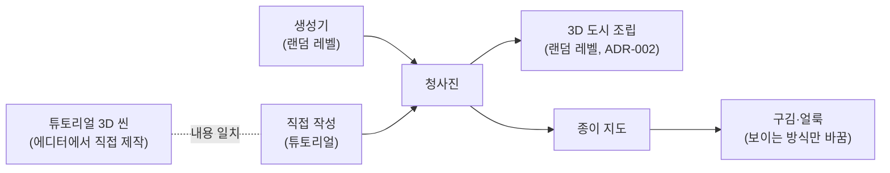

# ADR-001: 청사진 데이터를 원본으로 3D 도시와 종이 지도를 만든다

| | |
|---|---|
| **Status** | Accepted |
| **Date** | 2026-10-05 |
| **Deciders** | n0wst4ndup |
| **Related** | relates to [ADR-002](ADR-002-grid-generation-with-modular-tiles.md), [ADR-003](ADR-003-trait-selection-before-random-levels.md) |
| **미해결 갭** | 2건 (아래 [!MISSING] 블록 참조) |

## 요약

> 조수석의 종이 지도와 실제 도로가 항상 일치해야 하는 협동 길 찾기 게임에서, 지도와 도시 중 무엇을 원본으로 둘지 정해야 했다. 도시 배치 데이터인 청사진을 원본으로 두고 3D 도시와 종이 지도를 모두 청사진에서 만드는 방식을 채택했고, 완성된 도시 씬을 원본으로 두는 방식은 배제했다.
> 지도와 도로의 일치, 그리고 튜토리얼 이후 레벨의 랜덤 생성을 얻기 위해서다. 3D를 에디터에서 직접 만드는 튜토리얼은 청사진을 씬에 맞춰 따로 작성해야 하는 부담을 받아들인다.

---

## 1. 요구사항 / 문제

### 관측된 사실

- 조수석은 차량의 실시간 위치 표시 없이 도로와 주변 단서를 지도에 대조한다. 단서로 표지판, 도로 모양, 주변 풍경을 쓴다. ([GDD](../GDD.md) "역할별 행동", "지도와 길 안내")
- 레벨은 정사각형·직사각형 블록의 대도시에서 시작해, 말로 설명하기 애매한 도로 형태와 악천후로 확장한다. (GDD "레벨 디자인")
- 일반 차량은 차로와 신호에 따라 움직이고(초안 제안), 플레이어의 신호 위반은 기록해 평가에 쓴다. (GDD "일반 차량과 신호")
- 온라인에서 같은 차량, 교통 상황, 주행 결과를 공유해야 한다. (GDD "기술과 제작 원칙")
- 결정 시점에 도시·지도 관련 코드는 없다. (저장소, 2026-10-05)

### 요구사항 및 제약

- **기능 요구** (사용자, 2026-10-05 대화)
  - 랜덤으로 생성한 청사진을 조수석의 종이 지도에 보여준다.
  - 튜토리얼은 해안을 따라 달리는 고정 맵이다. 갈림길만 있고, 신호등이 없으며, 차량이 적고, 표지판 몇 개를 보여준다. 튜토리얼 이후 레벨은 모두 랜덤이다.
  - 지도에는 구김 질감이 있고, 확률적으로 얼룩이 묻어 일부가 가려진다. 그래서 청사진을 종이 위에 찍는 방식으로 표현한다.
  - 지도와 창밖을 대조하는 단서로 도로 이름, 방향 표지판, 랜드마크, 넓은 지형(공원·강·철길·바다 등)을 모두 쓴다.
- **품질 요구**
  - 지도와 실제 도로·단서가 일치해야 한다. 지도에 청사진을 표현하는 것이 가장 중요하다. (사용자)
  - 얼룩이 생겨도 위치를 추론할 최소한의 단서가 남아야 한다. (사용자. GDD 난도 원칙 "도로를 어렵게 만들더라도 위치를 추론할 수 있는 단서는 남긴다")
- **제약**
  - 두 PC가 같은 도시를 공유해야 한다. (GDD)
  - 교통 AI, 신호, 신호 위반 판정도 도로 정보가 필요하다. (GDD의 교통·신호 요구에서 도출)
  - 조정 수치는 별도로 관리하고 기획 문서에 넣지 않는다. (GDD "문서 범위") 이 문서에도 수치를 넣지 않는다.
- **비목표**
  - 랜덤 도시를 생성하고 3D로 조립하는 방식 → [ADR-002](ADR-002-grid-generation-with-modular-tiles.md)
  - 청사진을 지도 이미지로 인쇄하는 방식 → 후속 결정
  - 온라인에서 두 PC가 같은 청사진을 갖는 방식 → 후속 결정
  - 교통 AI 구현

### 결정 동인 (Decision Drivers)

1. 지도에 청사진을 표현하는 것, 곧 지도와 실제 도로의 일치. 사용자가 가장 중요하다고 밝혔다.
2. 튜토리얼 이후 레벨의 랜덤 생성.
3. 지도, 3D 도시, 교통이 같은 도로 정보를 쓰는 것.

1순위만 사용자가 정했고, 2와 3의 순서는 정하지 않았다.

---

## 2. 판단 근거

### 검토한 선택지

**옵션 A: 청사진 데이터를 원본으로 둔다**
- 개요: 생성기(랜덤 레벨)나 사람(튜토리얼)이 청사진을 만들고, 3D 도시와 종이 지도를 모두 청사진에서 만든다.
- 장점: 지도와 도시가 같은 데이터에서 나와 어긋나지 않는다(동인 1). 생성기가 청사진을 바꾸면 도시와 지도가 함께 바뀐다(동인 2). 교통과 신호도 같은 데이터를 쓸 수 있다(동인 3).
- 단점 / 감수해야 할 것: 청사진 형식과 생성기를 직접 설계해야 한다. 튜토리얼은 3D 씬과 청사진을 따로 만들어 서로 맞춰야 한다.
- 판정: **채택** — 세 동인을 모두 충족하는 유일한 선택지다.

**옵션 B: 완성된 도시 씬을 원본으로 둔다**
- 개요: 배치가 끝난 도시 씬(에셋에 들어 있는 씬 또는 직접 만든 씬)을 쓰고, 지도는 그 씬에서 만든다.
- 장점: 도시 하나를 빨리 확보할 수 있다. 지도 이미지는 위에서 내려다보는 카메라로 찍을 수 있다.
- 단점 / 감수해야 할 것: 도시가 하나로 고정된다. 교차로·차로·신호 정보와 도로 이름·표지판 내용 같은 단서는 씬과 별도로 입력해야 한다.
- 판정: **기각** — 튜토리얼 이후 레벨을 모두 랜덤으로 만든다는 요구(동인 2)를 충족하지 못한다.

### 검토했으나 배제한 방향

없음.

### 근거의 한계

- 청사진의 구체적인 형식(필드 구성)은 정하지 않았다. 이 결정은 단서 4종과 곡선 도로를 하나의 형식에 담을 수 있다는 가정에 기댄다.
- 튜토리얼 청사진을 3D 씬과 일치시키는 데 드는 작업량은 확인하지 않았다.

---

## 3. 설계

### 결정 내용

- 청사진은 도시 배치 데이터다. 3D 도시와 종이 지도는 청사진을 토대로 만든다.
- 청사진은 두 곳에서 온다. 랜덤 레벨은 생성기가 만들고, 튜토리얼은 사람이 작성한다.
- 지도 시스템은 청사진만 입력으로 받고, 그 청사진이 생성된 것인지 작성된 것인지 구분하지 않는다. 튜토리얼의 3D는 에디터에서 직접 만들고, 지도는 랜덤 레벨과 같은 시스템으로 그린다.
- 청사진은 도로망을 교차로(점)와 도로(선)로 이루어진 그래프로 저장하고, 곡선 도로를 표현할 수 있어야 한다. 튜토리얼의 해안 도로와 후반의 복잡한 도로 형태를 담기 위해서다.
- 청사진에는 단서 4종(도로 이름, 방향 표지판, 랜드마크, 넓은 지형)이 들어가고, 각 단서는 3D 도시와 지도에 같게 나타난다. 단서 종류는 모두 지원하고, 레벨마다 등장 빈도를 생성 규칙으로 조절한다.
- 생성기는 얼룩이 생겨도 위치를 추론할 수 있는 최소한의 단서를 보장한다.
- 구김과 얼룩은 지도가 보이는 방식만 바꾸고 청사진은 바꾸지 않는다.

### 변경 범위

- **바뀌는 것**: 도시와 지도를 만드는 기준 데이터로 청사진을 새로 정의한다.
- **바뀌지 않는 것**: 운전자는 지도를 열 수 없고, 실시간 위치 표시를 제공하지 않는다는 GDD 규칙. 기존 코드가 없으므로 고쳐야 할 구현도 없다.
- **인터페이스 / 계약**: 청사진이 청사진을 만드는 쪽(생성기, 튜토리얼 작성)과 쓰는 쪽(3D 도시, 지도) 사이의 계약이 된다. 세부 형식은 구현 단계에서 정한다.

### 구조

청사진을 지도 이미지로 인쇄하는 단계의 내부 구조는 후속 결정에서 정한다.

### 되돌리기

- 구현 전이라 지금은 되돌리는 비용이 낮다.
- 구현 후에는 생성기, 3D 조립, 지도가 모두 청사진 형식에 의존한다. 원본을 바꾸려면 세 부분을 함께 고쳐야 한다.

### 위험과 완화

| 위험 | 완화 |
|---|---|
| 직접 작성한 튜토리얼 청사진과 에디터에서 만든 3D 씬이 어긋난다 | 튜토리얼을 만든 뒤 Play Mode에서 지도와 실제 도로를 대조한다 |
| 단서 빈도가 낮은 레벨에 얼룩이 겹쳐 위치를 추론할 수 없게 된다 | 생성기가 최소 단서를 보장한다. 기준은 아직 없다 (갭: 최소 단서 보장 기준) |
| 지도와 일부러 다르게 만든 단서가 "단서는 3D와 지도에 같게 나타난다"는 원칙을 흐린다 | 의도된 예외는 해당 ADR에 명시한다. 현재 예외는 [ADR-003](ADR-003-trait-selection-before-random-levels.md)(제안)의 "잘못된 길을 알려주는 표지판" 디메리트다 |

---

## 4. 결과

> Status가 `Accepted`이므로 이 섹션은 검증 계획만 담는다. 실측값은 `Validated`가 된 뒤 채운다.

### 검증 방법 (Confirmation)

- **측정 지표**
  - 지도와 3D 도시의 일치: 지도에 그린 도로·교차로·단서가 3D 도시와 일치하는가 (품질 요구 1)
  - 얼룩 이후의 단서: 얼룩이 생긴 지도에서도 위치를 추론할 단서가 남는가 (품질 요구 2)
- **측정 방법**: Play Mode와 Game View에서 생성한 도시와 지도를 직접 대조한다.
- **측정 구간과 표본**: 정하지 않았다 (갭: 검증 표본)
- **판정 기준**: 의도된 예외를 빼고 지도와 3D 도시 사이에 불일치가 없으면 성공이다. 최소 단서의 판정 기준은 갭이 채워진 뒤 정한다.

### 측정 결과

아직 없음 — 구현 전.

### 예상과 달랐던 점

아직 없음 — 구현 전.

### 후속 조치

- 청사진을 지도 이미지로 인쇄하는 방식 결정 (별도 ADR)
- 온라인에서 두 PC가 같은 청사진을 갖는 방식 결정
- 청사진 형식 정의 (구현 단계)
- GDD "레벨 디자인"에 튜토리얼 고정 해안 맵과 이후 랜덤 레벨 구조 반영

---

## 부록

- 관련 이슈: #3
- 참조: [GDD](../GDD.md), [ADR-002](ADR-002-grid-generation-with-modular-tiles.md), [ADR-003](ADR-003-trait-selection-before-random-levels.md)
- 용어
  - **청사진**: 도시 배치 데이터. 도로망 그래프와 단서를 담는다.
  - **단서**: 조수석이 지도와 창밖을 대조하는 근거. 도로 이름, 방향 표지판, 랜드마크, 넓은 지형.
  - **생성 규칙**: 레벨마다 생성기에 주는 조건. 도시 크기, 도로 종류, 날씨, 단서 빈도 등.

> [!MISSING] 최소 단서 보장 기준
> 필요한 것: 얼룩과 낮은 단서 빈도가 겹쳐도 "위치를 추론할 수 있다"고 판단할 기준. 예를 들어 교차로 주변에 남아야 할 단서의 종류와 수.
> 확보 방법: 프로토타입에서 얼룩이 생긴 지도로 직접 길을 찾아보고 정한다.

> [!MISSING] 검증 표본
> 필요한 것: 일치 검증에 쓸 도시 수(시드 수)와 레벨 범위.
> 확보 방법: 생성기를 구현한 뒤 검증 계획을 세울 때 정한다.
