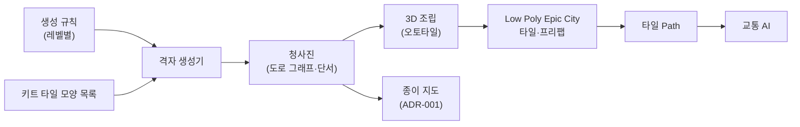

# ADR-002: 랜덤 도시를 격자 위에서 생성하고 Low Poly Epic City 타일로 조립한다

| | |
|---|---|
| **Status** | Accepted |
| **Date** | 2026-10-05 |
| **Deciders** | n0wst4ndup |
| **Related** | relates to [ADR-001](ADR-001-blueprint-as-source-of-truth.md), [ADR-003](ADR-003-trait-selection-before-random-levels.md), [ADR-005](ADR-005-terrain-first-generation-with-tunnel-caves.md), [ADR-006](ADR-006-separate-terrain-and-grade-separated-road-network.md) |
| **미해결 갭** | 3건 (아래 [!MISSING] 블록 참조) |

## 요약

> [ADR-001](ADR-001-blueprint-as-source-of-truth.md)에 따라 청사진에서 랜덤 도시를 만들어야 하는 상황에서, 생성 방식과 3D 조립 방식, 사용할 에셋을 정해야 했다. 격자 위에서 도로를 생성해 그래프로 저장하고, 3D는 모듈형 타일 키트인 Low Poly Epic City로 조립하는 방식을 채택했다. 그래프를 자유 형태로 생성해 도로 메시를 코드로 만드는 방식과 WFC는 배제했다.
> GDD 초반의 격자 도시를 기존 에셋으로 만들기 위해서이며, 생성기가 키트에 있는 타일 모양만 쓸 수 있고 직각 격자 밖의 도로 형태는 따로 확장해야 한다는 제약을 받아들인다.

---

## 1. 요구사항 / 문제

### 관측된 사실

- 청사진은 도로망을 곡선 표현이 가능한 그래프로 저장하고, 랜덤 레벨의 3D 도시는 청사진에서 조립한다. ([ADR-001](ADR-001-blueprint-as-source-of-truth.md))
- 레벨은 정사각형·직사각형 블록의 대도시에서 시작해 말로 설명하기 애매한 도로 형태로 확장한다. ([GDD](../GDD.md) "레벨 디자인")
- 프로젝트는 Unity 6000.6.0f1과 URP 17.6.0을 쓴다. (`ProjectSettings/ProjectVersion.txt`, `Packages/manifest.json`)
- 유료 에셋은 `Assets/Imported/`에 두고 Git에서 제외한다. (`.gitignore`, 커밋 5d9522d)
- Low Poly Epic City(polyperfect, 1.7.1)의 공개 자료 내용 (스토어 페이지와 퍼블리셔 문서, 2026-10-05 확인)
  - 콜라이더가 포함된 모델 프리팹이 1000개 이상이다. 지형 타일 94개, 건물 107개, 공사장 57개, 놀이공원 23개, 해변 16개 등이 들어 있다.
  - 주행·보행 타일마다 Tile 스크립트가 있다. Tile은 Awake에서 간격 1.5m 미만의 이웃 타일을 찾아 연결한다. 실행 중 타일을 추가하거나 수정하면 그 타일의 UpdateTile을 호출해야 한다. 실행 중 타일 추가·갱신은 1.5 버전부터 지원한다.
  - 타일 안의 Path는 도로·철길·보도 유형과 체크포인트 목록을 가진다. 차량·사람·기차는 A* 길찾기(맨해튼 거리 휴리스틱)로 Path를 따라간다.
  - 타일은 평지·터널·경사·다리 유형이 있다. 철길 건널목, 횡단보도, 신호등이 있고, 신호등은 두 신호 묶음을 정해진 시간마다 바꾼다.
  - AI 차량은 키네마틱 Rigidbody로 움직이고, 앞쪽 트리거로 차량·신호·횡단보도를 감지한다. 문서에 온라인 동기화 내용은 없다.
  - 스토어의 지원 버전 표기는 6000.0.36f1과 2021.3.15f1이다. 1.7.1의 URP 패키지에는 Global Settings가 들어 있다.
  - 타일 크기와 도로 타일 모양 목록은 공개 자료에 없다.
  - 퍼블리셔 문서의 금지 항목에 생성형 AI 프로그램의 데이터셋 포함·개발·입력으로 쓰는 것이 있다. 스토어 키워드에 `noai`가 있다.

### 요구사항 및 제약

- **기능 요구**
  - 청사진의 도로, 블록, 단서를 3D 도시로 조립한다. ([ADR-001](ADR-001-blueprint-as-source-of-truth.md))
  - 랜덤 레벨마다 새 도시를 만든다. (사용자: 튜토리얼 이후 레벨은 모두 랜덤)
  - 초반 레벨의 격자형 블록 도시를 만들 수 있어야 한다. (GDD)
- **품질 요구**
  - 생성기는 생성 결과를 스스로 검증한다. 최소 단서 보장은 ADR-001에서 정했다. 목적지 도달 가능성과 경로 길이 기준은 아직 없다. (갭: 생성 결과 검증 기준)
- **제약**
  - 생성기는 키트에 있는 타일 모양으로만 도로를 만들 수 있다.
  - 에셋 파일을 생성형 AI 도구의 입력으로 쓰지 않는다. (에셋 라이선스)
  - 게임 코드는 사용자가 직접 작성하고, AI는 설계·설명·디버깅·리뷰를 보조한다. (GDD "기술과 제작 원칙", `AGENTS.md`)
- **비목표**
  - 청사진을 지도 이미지로 인쇄하는 방식
  - 곡선·사선 도로의 구체적인 조립 방식
  - 교통 AI의 온라인 동기화와 플레이어 신호 위반 판정 구현
  - 튜토리얼 3D 씬 제작 방식

### 결정 동인 (Decision Drivers)

- ADR-001의 청사진(그래프)으로 3D 도시를 조립할 수 있을 것
- GDD 초반의 격자형 블록 도시를 만들 수 있을 것
- 기존 도시 에셋을 활용할 것. 사용자가 처음 고민한 지점이다.
- 후반의 복잡한 도로 형태로 확장할 여지가 있을 것 (GDD)

대화에서 동인 사이의 순위는 정하지 않았다.

---

## 2. 판단 근거

### 검토한 선택지

**옵션 A: 격자 생성 + 모듈형 타일 조립**
- 개요: 격자 위에 도로를 깔고, 일부 구간을 끊거나 블록을 합쳐 변화를 준다. 결과는 그래프로 바꿔 청사진에 저장한다. 3D는 칸마다 상하좌우 이웃이 도로인지 보고 직선·코너·T자·십자 타일을 골라 놓는다(오토타일).
- 장점: GDD 초반의 격자 도시와 그대로 맞는다. 모듈형 에셋 키트를 쓸 수 있다. 일직선 도로에 이름을 붙이기 쉬워 도로 이름 단서와 맞는다.
- 단점 / 감수해야 할 것: 직각 격자만 나온다. 생성할 수 있는 도로 모양이 키트의 타일에 묶인다.
- 판정: **채택** — 격자 도시와 에셋 활용 동인을 충족한다. 확장 동인은 청사진을 그래프로 저장해 두고, 곡선 도로가 필요할 때 옵션 B의 방식을 그 도로에만 쓰는 방향으로 대응한다.

**옵션 B: 그래프 생성 + 코드로 도로 메시 생성**
- 개요: 교차로와 도로를 자유로운 각도와 곡선으로 놓고, 도로 메시를 코드로 만든다.
- 장점: 어떤 도로 형태든 표현할 수 있다.
- 단점 / 감수해야 할 것: 교차로 메시를 만들고 불규칙한 블록에 건물을 채우기가 어렵다. 지도와 교통을 시험할 수 있을 때까지 오래 걸린다. 정해진 크기의 블록에 맞춘 모듈형 에셋과 덜 맞는다.
- 판정: **기각** — 초반 격자 도시에는 필요 이상으로 복잡하고, 에셋 활용 동인과 맞지 않는다. 후반 곡선 도로를 위한 확장 방식으로 남긴다.

**옵션 C: WFC (Wave Function Collapse)**
- 개요: 타일끼리 이웃할 수 있는 규칙을 주고 배치를 생성한다.
- 장점: 이웃 규칙만으로 다양한 배치를 만든다.
- 단점 / 감수해야 할 것: 원 구현이 보장하는 조건은 출력의 N×N 패턴이 모두 입력에 있다는 지역 조건이고, 전파 중 모순이 생기면 진행할 수 없다. ([mxgmn/WaveFunctionCollapse](https://github.com/mxgmn/WaveFunctionCollapse)) 도시 전체의 연결이나 목적지까지의 거리 같은 전역 조건은 보장 대상이 아니다.
- 판정: **기각** — 생성기가 보장해야 하는 전역 조건(최소 단서, 도달 가능성)을 기본 알고리즘으로 보장할 수 없다.

### 도시 에셋 평가

Low Poly Epic City 하나만 평가했고 다른 에셋과 비교하지 않았다. 판단은 공개 자료 기준이며, 패키지를 임포트해 확인하지 않았다.

- **맞는 점**: 도로가 타일 단위이고 실행 중 타일 추가를 지원해, 랜덤 레벨을 시작할 때 청사진대로 조립하는 방식과 맞는다. 타일에 차로 경로와 길찾기가 들어 있어 교통 AI의 출발점으로 쓸 수 있다. 다리·철길·건널목은 넓은 지형 단서(강, 철길)의 재료가 되고, 건물·공사장·놀이공원 모델은 랜드마크 후보, 해변 모델은 튜토리얼 해안 풍경의 재료가 된다.
- **확인할 점**: 타일 크기와 도로 모양 목록, Unity 6000.6.0f1에서의 동작, URP Global Settings가 프로젝트의 렌더링 설정과 겹치는지.
- **직접 만들어야 하는 것**: 두 PC 사이의 교통 동기화와 플레이어 신호 위반 판정. 문서상 AI 차량은 단순한 구조이고 온라인 동기화 내용이 없다.

### 검토했으나 배제한 방향

- 에셋에 들어 있는 완성형 도시 씬(Day & Night City)을 랜덤 레벨의 원본으로 쓰는 방향. ADR-001에서 완성된 도시 씬을 원본으로 두는 방식을 기각했다.

### 근거의 한계

- 키트의 타일 모양이 생성기에 필요한 도로 모양을 충분히 갖췄다는 가정에 기댄다. 공개 자료로는 확인하지 못했다.
- 교통 기능은 퍼블리셔 문서로만 판단했다.
- WFC는 원 구현 기준으로 판단했다. 전역 조건을 추가한 변형은 검토하지 않았다.
- 다른 도시 에셋과 비교하지 않았다.

---

## 3. 설계

### 결정 내용

- 랜덤 도시는 격자 위에서 생성하고, 결과를 그래프로 바꿔 청사진에 저장한다.
- 랜덤 레벨의 3D 도시는 청사진을 읽어 Low Poly Epic City의 타일과 프리팹으로 조립한다. 도로 타일은 이웃 칸의 도로 여부에 따라 고른다.
- 생성기가 만드는 도로 모양은 키트에 있는 타일 모양으로 제한한다. 예를 들어 막다른 길 타일이 없으면 막다른 길을 만들지 않는다.
- 차로 단위 경로는 키트 타일의 Path를 교통 AI에 쓰고, 지도와 생성기는 청사진의 도로 단위 그래프를 쓴다.
- 곡선·사선 도로가 필요해지면 코드로 만든 도로(옵션 B)를 해당 도로에만 추가하는 방향으로 확장한다.
- 에셋 파일(프리팹, 메시, 텍스처, 스크립트)은 생성형 AI 도구의 입력으로 쓰지 않는다. AI 보조는 공개 문서와 사용자의 설명을 기준으로 한다.

### 변경 범위

- **바뀌는 것**: 도시 에셋으로 Low Poly Epic City를 도입한다. 랜덤 도시의 생성·조립 방식을 정한다.
- **바뀌지 않는 것**: 청사진이 원본이고 지도는 청사진으로만 그린다는 ADR-001의 원칙. 유료 에셋을 Git에 넣지 않는 규칙.
- **인터페이스 / 계약**: 생성기는 키트의 타일 모양 목록에 의존한다. 지도 시스템은 키트를 알지 않는다.

### 구조

### 되돌리기

- 구현 전이라 생성·조립 방식은 지금 바꾸기 쉽다.
- 구현 후 키트를 바꾸면 3D 조립과 생성기의 타일 모양 목록을 함께 바꿔야 한다. 청사진과 지도는 직접 영향을 받지 않는다.

### 위험과 완화

| 위험 | 완화 |
|---|---|
| 키트에 필요한 도로 모양이 없다 | 임포트 후 타일 모양 목록을 정리하고, 생성기가 없는 모양을 만들지 않게 한다 (갭: 타일 크기와 도로 모양 목록) |
| 타일을 하나씩 놓으면 먼저 놓인 타일이 나중에 놓인 이웃을 찾지 못한다. Tile은 Awake에서 이웃을 찾는다 | 퍼블리셔 문서대로, 배치를 마친 뒤 수정한 타일의 UpdateTile을 호출한다 |
| Unity 6000.6.0f1에서 동작하지 않거나, URP Global Settings가 기존 렌더링 설정과 겹친다 | 임포트 목록을 확인하고, 임포트 후 콘솔 오류와 URP 머티리얼을 확인한다 (갭: Unity 6000.6.0f1 호환성과 URP 설정 영향) |
| 에셋의 교통 AI에 온라인 동기화가 없다 | 대응 미정 — 온라인 동기화를 설계할 때 다룬다 |
| 라이선스의 AI 사용 금지 범위를 넓게 해석하면 AI 보조가 제한된다 | 에셋 파일을 AI 도구에 넣지 않는다. 범위가 불분명하면 퍼블리셔에게 확인한다 |

---

## 4. 결과

> Status가 `Accepted`이므로 이 섹션은 검증 계획만 담는다. 실측값은 `Validated`가 된 뒤 채운다.

### 검증 방법 (Confirmation)

- **측정 지표**
  - 키트 적합성: 생성기에 필요한 도로 모양을 키트 타일로 만들 수 있는가
  - 조립 정확성: 청사진대로 조립한 3D 도시의 도로 연결이 청사진 그래프와 일치하는가
  - 교통 연결: 키트의 AI 차량이 조립된 도시의 타일을 따라 주행하는가
  - 호환성: 프로젝트 버전에서 임포트 후 콘솔 오류와 머티리얼 문제가 없는가
- **측정 방법**: 임포트 후 타일 목록을 정리하고, Play Mode와 Game View에서 조립 결과와 AI 차량 주행을 직접 확인한다.
- **측정 구간과 표본**: 생성기를 구현한 뒤 ADR-001의 검증 표본과 함께 정한다.
- **판정 기준**: 필요한 도로 모양을 모두 만들 수 있고, 조립 결과가 청사진과 일치하며, 콘솔 오류 없이 AI 차량이 주행하면 성공이다.

### 측정 결과

아직 없음 — 에셋 임포트와 구현 전.

### 예상과 달랐던 점

아직 없음 — 에셋 임포트와 구현 전.

### 후속 조치

- 에셋을 임포트한 뒤 타일 크기와 도로 모양 목록 정리
- 곡선·사선 도로 확장 방식 결정
- 교통 AI의 온라인 동기화 방식과 플레이어 신호 위반 판정 설계
- 생성 결과 검증 기준(도달 가능성, 경로 길이) 결정

---

## 부록

- 관련 이슈: #3
- 참조
  - [Low Poly Epic City — Unity Asset Store](https://assetstore.unity.com/packages/3d/environments/urban/low-poly-epic-city-202624)
  - [Low Poly Epic City 퍼블리셔 문서](https://docs.google.com/document/d/1_yoq0p-g_hz3fEzp6YJABZK3FgQa3w5pBnSJmsdOq0A/edit?usp=sharing)
  - [mxgmn/WaveFunctionCollapse](https://github.com/mxgmn/WaveFunctionCollapse)
- 용어
  - **오토타일**: 칸의 이웃 상태를 보고 놓을 타일 모양을 자동으로 고르는 방식
  - **Path**: Low Poly Epic City 타일 안에 들어 있는 차로·보도·철길 경로

> [!MISSING] 타일 크기와 도로 모양 목록
> 필요한 것: 도로 타일 한 칸의 크기와, 직선·코너·T자·십자·막다른 길·곡선 가운데 실제로 들어 있는 모양.
> 확보 방법: 에셋을 임포트한 뒤 사용자가 직접 확인한다. 라이선스 때문에 AI 도구로 에셋 파일을 읽지 않는다.

> [!MISSING] Unity 6000.6.0f1 호환성과 URP 설정 영향
> 필요한 것: 임포트 후 콘솔 오류 여부, URP 머티리얼 표시, Global Settings가 기존 설정을 바꾸는지.
> 확보 방법: 임포트 창의 파일 목록을 확인하고, 임포트 후 Console과 Scene View를 확인한다.

> [!MISSING] 생성 결과 검증 기준
> 필요한 것: 목적지 도달 가능성과 출발지에서 목적지까지의 경로 길이를 판정하는 기준.
> 확보 방법: 생성기 프로토타입으로 여러 도시를 만들어 보고 정한다.
