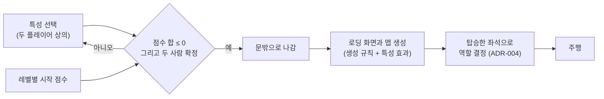

# ADR-003: 랜덤 레벨 출발 전에 특성을 고르고, 특성 점수 합이 0 이하일 때만 출발한다

| | |
|---|---|
| **Status** | Proposed |
| **Date** | 2026-10-05 (제안) |
| **Deciders** | n0wst4ndup |
| **Related** | relates to [ADR-001](ADR-001-blueprint-as-source-of-truth.md), [ADR-002](ADR-002-grid-generation-with-modular-tiles.md), [ADR-004](ADR-004-roles-by-boarding-seat.md) |
| **미해결 갭** | 2건 (아래 [!MISSING] 블록 참조) |

## 요약

> 튜토리얼 이후 랜덤 레벨마다 다른 경험을 주고 출발 전 대화를 끌어내기 위해, 두 플레이어가 메리트·디메리트 특성을 함께 고르고 특성 점수 합이 0 이하일 때만 출발하는 방식을 제안한다. 메리트는 +, 디메리트는 −로 세고 레벨이 오를수록 커지는 시작 점수를 더하므로, 높은 레벨일수록 디메리트를 더 골라야 한다. 합이 정확히 0이어야 하는 방식과 합이 0 이상이면 되는 방식은 배제했다.
> 판마다 다른 경험, 출발 전 대화, 난이도 선택권을 얻기 위해서이며, 특성 효과를 맵 생성과 여러 시스템에 연결하는 부담과, 잘못된 길을 알려주는 표지판이 ADR-001의 단서 일치 원칙의 예외가 되는 것을 받아들인다.

---

## 1. 요구사항 / 문제

### 관측된 사실

- 제안 당시(2026-10-05) GDD에는 특성 시스템이 없었다. 현재 GDD의 "출발 전 특성과 역할 — 제안"은 이 ADR을 `Proposed`로 참조하며, 확정된 플레이 흐름을 대체하지 않는다. 레벨 선택과 해금 방식은 여전히 미정이다. ([GDD](../GDD.md) "레벨 디자인")
- 레벨은 쉬운 격자형 도시에서 복잡한 도로와 악천후로 확장한다. (GDD "게임 개요")
- 튜토리얼은 고정 맵이고 이후 레벨은 모두 랜덤이다. 단서 등장 빈도는 레벨마다 생성 규칙으로 조절하고, 생성기는 얼룩이 생겨도 위치를 추론할 최소 단서를 보장한다. 구김과 얼룩은 지도가 보이는 방식만 바꾼다. ([ADR-001](ADR-001-blueprint-as-source-of-truth.md))
- 참고한 프로젝트 좀보이드의 특성: 긍정 특성은 점수를 쓰고 부정 특성은 점수를 돌려주며, 남은 점수가 0 이상이어야 캐릭터를 만들 수 있다. 직업에 따라 시작 점수가 다르다. ([Supercraft의 캐릭터 생성 가이드](https://supercraft.host/wiki/project-zomboid/character-creation), 제3자 자료)

### 요구사항 및 제약

- **기능 요구** (사용자, 2026-10-05 대화)
  - 랜덤 레벨을 시작하기 전마다 두 플레이어가 상의해 특성을 고른다. 튜토리얼에는 적용하지 않는다.
  - 특성은 메리트와 디메리트로 나뉘고 점수를 가진다. 사용자가 든 예는 다음과 같다.
    - 메리트: 날씨가 화창할 확률 증가, 도로 교통에 유리한 효과, 조수석이 지도를 잘못 드는 실수 감소, 표지판이 더 많이 등장
    - 디메리트: 악천후 발생 확률 증가, 난폭 운전자 등장, 신호를 무시하는 사람 등장, 지도를 잘못 드는 실수 증가, 확률적으로 잘못된 길을 알려주는 표지판
  - 메리트 점수는 +, 디메리트 점수는 −로 더하고 레벨별 시작 점수를 더한 합이 0 이하일 때만 출발할 수 있다. 시작 점수는 레벨이 오를수록 커진다.
  - 두 사람이 모두 확정해야 출발한다.
  - 특성 효과는 고른 사람이 아니라 게임 시스템 전반에 적용된다.
  - 특성을 고르고 문밖으로 나가면 로딩 화면과 함께 맵이 생성된다. 맵 생성에 영향을 주는 특성(표지판 빈도, 잘못된 길을 알려주는 표지판, 악천후 등)은 이때 반영된다.
  - "지도를 잘못 드는 실수"는 조수석이 지도를 내렸다가 다시 꺼낼 때 90도나 180도 돌아간 채로 들거나, 극단적으로 뒷면을 드는 것이다. 운전석은 A/D로 핸들을 조작하고, 조수석은 지도를 돌릴 수 있게 할 예정이다.
- **품질 요구**: 측정 가능한 목표치는 정하지 않았다. 판단 기준은 아래 결정 동인이다.
- **제약**
  - 특성별 점수와 시작 점수 증가량 같은 조정 수치는 별도로 관리하고 문서에 확정값으로 넣지 않는다. (GDD "문서 범위") 사용자가 낸 시작 점수 증가량 초안은 레벨당 +1이다.
  - 생성기는 최소 단서를 보장해야 한다. (ADR-001)
- **비목표**
  - 특성 목록과 특성별 점수 값 확정
  - 선택 화면과 확정 절차의 세부
  - 각 효과(날씨, 교통, 지도 실수, 표지판)의 구현
  - 레벨 진행과 해금 방식
  - 역할을 정하는 방식 → [ADR-004](ADR-004-roles-by-boarding-seat.md)

### 결정 동인 (Decision Drivers)

1. 판마다 다른 경험
2. 출발 전 대화 유도. 상의한 것과 다르게 원하는 좌석에 먼저 앉는 "배신" 같은 경험을 포함한다.
3. 난이도 선택권

사용자가 정한 순서는 1 > 2 ≥ 3이다.

---

## 2. 판단 근거

### 검토한 선택지: 출발 조건

**옵션 A: 합이 정확히 0일 때만 출발**
- 개요: 사용자의 첫 제안("±0")이다.
- 장점: 메리트와 디메리트가 정확히 균형을 이룬다.
- 단점 / 감수해야 할 것: 디메리트를 더 골라 난이도를 올릴 수 없다.
- 판정: **기각** — 사용자가 난이도 조절을 위해 "0 이하일 때만 출발"로 바꿨다(동인 3).

**옵션 B: 합이 정확히 0이고, 메리트와 디메리트를 최소 하나씩 골라야 출발**
- 개요: 옵션 A에 특성 없이 출발하는 경우를 막는 조건을 더한다.
- 단점 / 감수해야 할 것: 옵션 A처럼 디메리트를 더 골라 난이도를 올릴 수 없다.
- 판정: **기각** — 사용자가 고르지 않았다. 별도 사유는 밝히지 않았다.

**옵션 C: 합이 0 이상이면 출발**
- 개요: 메리트가 디메리트보다 많아도 출발할 수 있다.
- 판정: **기각** — 사용자는 0 이하일 때만 출발하도록 정했다.

**옵션 D: 레벨별 시작 점수를 포함한 합이 0 이하일 때만 출발**
- 개요: 메리트(+)와 디메리트(−)에 레벨이 오를수록 커지는 시작 점수를 더한 합이 0 이하여야 출발한다.
- 장점: 디메리트를 더 골라 난이도를 올릴 수 있다(동인 3). 높은 레벨일수록 어떤 디메리트를 받을지 상의해야 하고(동인 2), 판마다 특성 조합이 달라질 여지가 커진다(동인 1).
- 단점 / 감수해야 할 것: 레벨별 시작 점수를 상쇄할 만큼 디메리트가 있어야 출발할 수 있다.
- 프로젝트 좀보이드와의 비교: 좀보이드의 조건을 이 문서의 부호로 옮기면 "메리트 − 디메리트 ≤ 시작 점수"이므로, 0 이하 조건 자체는 좀보이드와 같은 방향이다. 다른 점은 시작 점수다. 좀보이드는 직업에 따라 메리트를 고를 여유가 늘거나 줄지만, 이 게임의 레벨별 시작 점수는 레벨이 오를수록 디메리트를 더 고르게 만든다.
- 판정: **제안**

### 검토한 선택지: 레벨별 시작 점수의 방향

**옵션 E: 시작 점수를 메리트에 쓰는 예산으로 본다**
- 개요: 레벨이 오를수록 메리트를 더 고를 수 있다.
- 판정: **기각** — 사용자가 레벨이 오를수록 디메리트를 더 고르는 방향(옵션 D)을 택했다.

### 검토했으나 배제한 방향

- 특성 효과를 고른 사람이나 그 사람이 앉은 좌석에만 적용하는 방향. 대화에서 좌석에 적용하는 안을 확인했고, 사용자는 게임 시스템 전반에 적용하기로 정했다.

### 근거의 한계

- 특성 목록과 점수가 없어, 0 이하 조건과 레벨별 시작 점수가 실제로 어떤 난이도를 만드는지 확인하지 않았다.
- 이 규칙으로 판마다 다른 경험과 출발 전 대화(동인 1·2)가 생기는지 플레이로 검증하지 않았다.
- 잘못된 길을 알려주는 표지판이나 관찰을 어렵게 하는 악천후 같은 디메리트가 ADR-001의 최소 단서 보장과 어떻게 함께 작동할지 정하지 않았다. (갭: 디메리트와 최소 단서 보장의 관계)

---

## 3. 설계

### 결정 내용 (제안)

- 튜토리얼에는 특성을 적용하지 않는다. 랜덤 레벨을 시작하기 전마다 두 플레이어가 상의해 특성을 고른다.
- 특성은 메리트(+)와 디메리트(−) 점수를 가진다. 고른 특성 점수와 레벨별 시작 점수를 더한 합이 0 이하이고, 두 플레이어가 모두 확정해야 출발할 수 있다.
- 레벨별 시작 점수는 레벨이 오를수록 커진다. 증가량은 조정 수치로 관리한다.
- 특성 효과는 고른 사람이나 좌석이 아니라 게임 시스템 전반에 적용된다. 어느 역할에 유리한 특성을 고를지는 플레이어가 상의해 정하고, 역할은 탑승한 좌석으로 정해진다. ([ADR-004](ADR-004-roles-by-boarding-seat.md))
- 특성을 확정하고 문밖으로 나가면 로딩 화면과 함께 맵이 생성된다. 맵 생성에 영향을 주는 특성은 이때 반영되며, 생성기는 레벨별 생성 규칙과 특성 효과를 함께 입력으로 받는다.
- 잘못된 길을 알려주는 표지판은 ADR-001의 "단서는 3D 도시와 지도에 같게 나타난다" 원칙의 의도된 예외다. 이 디메리트를 넣으려면 청사진이 표지판이 실제로 가리켜야 할 방향과 표지판에 표시되는 내용을 구분해 담아야 한다.
- 지도를 잘못 드는 실수는 지도가 보이는 방식만 바꾸는 이벤트이고 청사진은 바꾸지 않는다. (ADR-001) 조수석은 지도를 돌려 바로잡는다. 뒷면을 든 경우의 조작은 정하지 않았다.

### 변경 범위

- **바뀌는 것**: 랜덤 레벨을 시작하기 전에 특성 선택·확정 단계가 생긴다. 맵 생성의 입력에 특성 효과가 더해진다.
- **바뀌지 않는 것**: 튜토리얼 흐름. 청사진이 원본이라는 ADR-001의 원칙(잘못된 표지판 예외 제외). 조정 수치를 문서 밖에서 관리하는 규칙.
- **인터페이스 / 계약**: 생성기는 생성 규칙과 특성 효과를 함께 받는다. 날씨, 교통, 지도 이벤트는 특성 효과에 따라 확률이나 등장 여부가 바뀐다.

### 구조

### 되돌리기

- 제안 단계이고 구현이 없어 자유롭게 바꿀 수 있다.
- 특성 효과를 생성기와 날씨·교통·지도 이벤트에 연결한 뒤에는 바꿔야 할 범위가 넓어진다.

### 위험과 완화

| 위험 | 완화 |
|---|---|
| 잘못된 표지판이나 악천후 같은 디메리트가 최소 단서 보장과 충돌해 위치를 추론할 수 없게 된다 | 대응 미정 — ADR-001의 최소 단서 보장 기준을 정할 때 함께 다룬다 (갭: 디메리트와 최소 단서 보장의 관계) |
| 레벨별 시작 점수가 고를 수 있는 디메리트 점수보다 커져 출발할 수 없게 된다 | 대응 미정 — 특성 목록과 점수를 정할 때 확인한다 |
| 특성 효과가 생성기, 날씨, 교통, 지도 이벤트에 걸쳐 있어 구현 범위가 넓다 | 대응 미정 — 특성 목록을 정할 때 다룬다 |

---

## 4. 결과

> Status가 `Proposed`이므로 이 섹션은 가설과 검증 계획만 담는다.

### 검증 방법 (Confirmation)

- **측정 지표**
  - 판마다 다른 경험: 같은 레벨을 다른 특성 조합으로 플레이할 때 경험이 달라지는가 (동인 1)
  - 출발 전 대화: 특성 선택 단계에서 두 플레이어가 역할과 특성을 두고 상의하는가 (동인 2)
  - 난이도 선택권: 디메리트를 더 고르면 체감 난이도가 오르는가 (동인 3)
- **측정 방법**: 두 사람이 실제로 플레이하는 테스트에서 관찰하고 기록한다.
- **측정 구간과 표본, 판정 기준**: 정하지 않았다 (갭: 검증 표본과 판정 기준)

### 측정 결과

아직 없음 — 제안 단계.

### 예상과 달랐던 점

아직 없음 — 제안 단계.

### 후속 조치

- 특성 목록과 특성별 효과 정의
- 특성별 점수와 레벨별 시작 점수 증가량을 조정 수치로 관리. 수치 관리 형식과 위치는 GDD에 따라 별도 작업에서 정한다.
- 선택 화면과 두 사람 확정 절차 설계
- 지도 뒷면을 든 경우의 조작 결정
- 제안을 채택하면 GDD의 확정 플레이 흐름과 특성 시스템 설명 갱신. 현재 GDD에는 제안으로 참조했다.
- 검토가 끝나면 Status를 `Accepted`로 올린다

---

## 부록

- 관련 이슈: #4
- 참조: [GDD](../GDD.md), [ADR-001](ADR-001-blueprint-as-source-of-truth.md), [ADR-002](ADR-002-grid-generation-with-modular-tiles.md), [ADR-004](ADR-004-roles-by-boarding-seat.md), [Supercraft의 프로젝트 좀보이드 캐릭터 생성 가이드](https://supercraft.host/wiki/project-zomboid/character-creation)
- 용어
  - **특성**: 랜덤 레벨 시작 전에 고르는 효과. 메리트와 디메리트로 나뉜다.
  - **특성 점수**: 특성 선택에 쓰는 점수. 도착 후 평가의 스코어와는 다르다.
  - **레벨별 시작 점수**: 특성 점수 합에 더하는 값. 레벨이 오를수록 커진다.

> [!MISSING] 디메리트와 최소 단서 보장의 관계
> 필요한 것: 잘못된 길을 알려주는 표지판이나 악천후 같은 디메리트가 있을 때 생성기가 보장할 최소 단서의 범위. 예를 들어 잘못된 표지판을 단서 수에 넣을지.
> 확보 방법: ADR-001의 최소 단서 보장 기준을 정할 때 함께 정한다.

> [!MISSING] 검증 표본과 판정 기준
> 필요한 것: 플레이테스트 횟수와 참가 조합, 동인별 성공·실패 판정 기준.
> 확보 방법: 특성 선택 프로토타입을 만든 뒤 테스트 계획을 세울 때 정한다.
